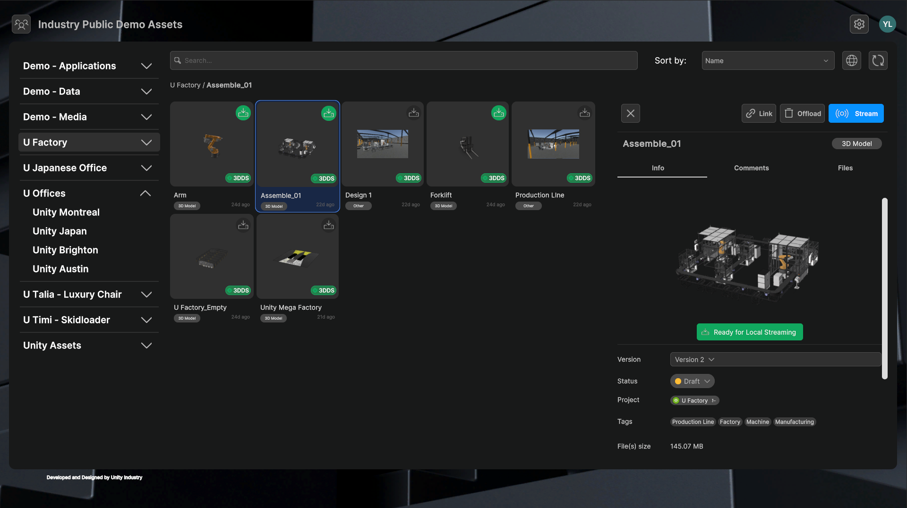

# Industry Viewer Template

The Industry Viewer Template is designed for new and existing Unity users who would like to quickly create 3D collaborative applications to explore, share, and review their 3D assets. It offers an extended experience based on Unity Asset Manager, enabling users to connect to Asset Manager's features easily and with minimal project setup requirements. There are three key features offered by this Viewer Template: 

* Access to the assets on Asset Manager, powered by AM SDKs  
* Ready-to-experienced runtimes for 3D collaboration  
* An open-source, customizable Editor project

## Get started

Refer to the provided documentation for details on how to set up the template and get started with your project. 

| **Topic** | **Description** |
| :---- | :---- |
| [**Prerequisites**](Documentation/prerequisites.md) | Install the necessary prerequisites for the Industry Viewer Template. |
| [**Get started with the Industry Viewer Template**](Documentation/get-started/get-started.md) | Install the Industry Viewer Template in your Unity environment and understand the experience of the end user of the Industry Viewer Template. |
|[**Asset preparation and management on Unity Cloud**](Documentation/prepare-your-assets.md)|Prepare your assets for use with the Industry Viewer Template.|
|[**Unity Editor project settings and customization**](Documentation/project-settings-customization/ps-customization-editor.md)|Understand how to update and customize  the main components of the Industry Viewer Template.|
| [**Build and publish**](Documentation/build-and-publish.md) | Understand how to build and publish the project across multiple platforms. |
| [**Glossary**](https://docs.unity3d.com/Manual/Glossary.html) | Refer to the glossary for definitions of common Unity terminology found in this documentation. |

## Example images

